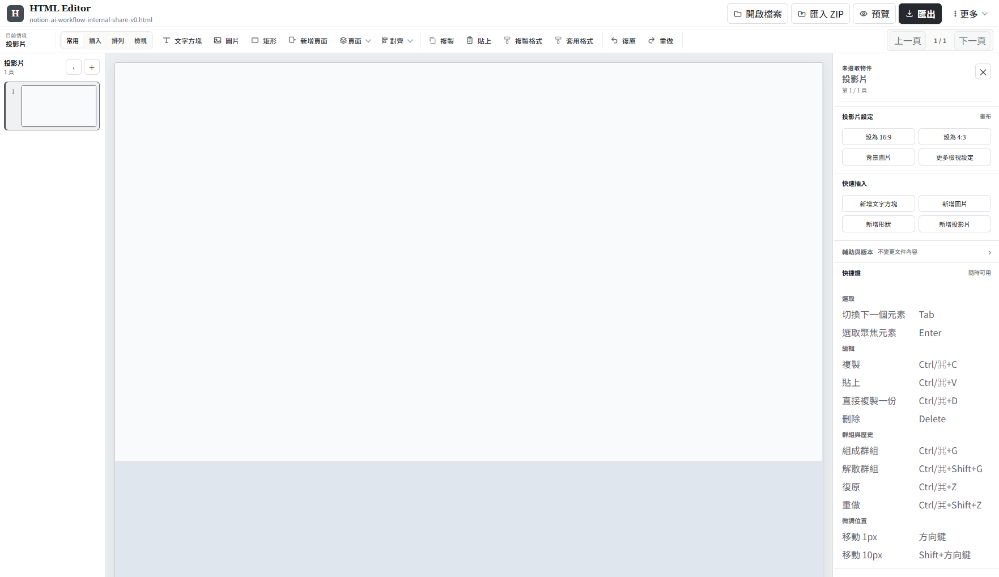

# Local HTML Slide Editor｜本地 HTML 簡報編輯器

[](https://github.com/yucheng-chang-yc/local-html-slide-editor/actions/workflows/ci.yml)


*[English README](README.md)*

**把 AI 生成的 HTML 簡報，轉成可以持續修改的工作檔。**

Local HTML Slide Editor 可開啟既有 HTML 或 ZIP 簡報，直接以簡報式操作修改畫面上的真實元素，再匯出成 HTML 或 ZIP，之後仍可重新開啟並繼續編輯。

### 快速試用

**[開啟瀏覽器預覽版](https://staging.local-html-slide-editor.pages.dev/)**

目前提供 staging build 供快速試用，不需安裝。檔案與工作區資料保存在目前瀏覽器中；需要可攜式副本時，可匯出 HTML 或 ZIP。



## 為什麼需要這個工具

HTML 簡報完成生成後，真正頻繁發生的是小幅人工修改：移動卡片、修正標題、更換圖片、重新對齊物件。若每次都回到原始碼或重新生成整份簡報，修改成本會快速上升。

一個可持續使用的編輯器必須同時維持：

- **Rendered identity：** 畫布上選到的元素，仍是實際被修改的元素。
- **Layout stability：** 移動單一物件時，不造成附近內容無預期 reflow。
- **Source integrity：** 無關的 scripts、assets 與 markup 維持原樣。
- **Round-trip continuity：** 修改在匯出、reload 與重新匯入後仍然存在。

## 運作方式

```text
HTML / ZIP
   ↓
相容性分類
   ↓
視覺編輯工作區
   ↓
source-aware patches / bounded deck serialization
   ↓
HTML / ZIP 匯出
   ↓
重新開啟並繼續編輯
```

支援兩種 local-first 執行方式：

- **本機伺服器模式：** Node/Express 將 workspace 與 snapshots 保存在本機專案資料目錄。
- **純瀏覽器模式：** IndexedDB 保存 workspace；支援時同步鏡像到 OPFS。

兩種模式都將原始匯入內容與目前工作版本分開保存。

## 核心設計

### 明確界定可編輯範圍

HTML 簡報可能使用 fixed canvas、flow/flex/grid、nested transform、framework-controlled DOM、Shadow DOM 或 canvas-only rendering。編輯器會先分類文件，再決定可提供的操作：

```ts
type CompatibilityLevel = 'SUPPORTED' | 'MIXED' | 'READ_ONLY';
```

- **SUPPORTED：** 一般靜態簡報結構可直接編輯。
- **MIXED：** 高風險 subtree 受限，其餘區域維持可用。
- **READ_ONLY：** 無法建立可靠 editing mapping 的結構維持唯讀，並顯示原因。

### 一般修改保留未觸碰來源

原始 HTML 維持 canonical source。文字、樣式、幾何與 attribute 修改會形成 typed patch operations，套用到已建立 source mapping 的元素。投影片結構變更可重建已識別的 deck container，deck 邊界之外的來源維持不變。

### 自由拖拉仍尊重 layout flow

flow 元素第一次 drag／resize 會被處理成一個可逆 transaction：

1. 在原 flow 位置保留不可見、等尺寸的 placeholder；
2. 將真正元素轉為自由定位；
3. 保留元素 identity 與畫面幾何；
4. 轉換與移動一次 commit，讓 Undo／Redo 能一致還原。

## 編輯能力

- **畫布：** 點選、多選、框選、拖曳、八向縮放、旋轉、鍵盤微調、格線／參考線、對齊、平均分布、群組／取消群組與圖層排序。
- **內容：** 富文字、字型、字號、字重、對齊、行高、顏色、形狀內文字、基本形狀、表格、圖片裁切／符合、比例鎖定與格式刷。
- **簡報：** 即時縮圖、新增／複製／重排／刪除投影片、尺寸與背景、講者備註、講者檢視、列印、縮放與 contextual inspector。
- **可攜與復原：** 開啟 HTML 或 ZIP、本機 autosave、snapshot restore、匯出 HTML／ZIP，再重新開啟匯出結果。

介面以 desktop-first 的簡報編輯工作流為主。

## 架構

```text
source HTML / ZIP
       ↓
workspace adapter
(Node filesystem / browser IndexedDB + OPFS)
       ↓
compatibility classifier + editable source mapping
       ↓
sandboxed editing iframe
       ↓
selection / commands / history / inspector
       ↓
typed source patches + bounded deck serialization
       ↓
HTML / ZIP export
```

主要邊界包含 edit mode 停用來源 scripts、sandboxed execution preview、可靜態分析的 speaker notes、ZIP 路徑驗證，以及無法可靠建立 mapping 時採 fail closed。

來源／編輯／匯出契約可見 [`docs/EDITABLE_DECK_CONTRACT.md`](docs/EDITABLE_DECK_CONTRACT.md)。

## 驗證

Repository 保留多層次自動化測試：

- [`tests/unit/`](tests/unit/)：核心 parsing、source mapping、history 與 safety behavior。
- [`tests/integration/`](tests/integration/)：跨模組 workspace 與 export behavior。
- [`tests/e2e/`](tests/e2e/)：本機 editor interaction workflows。
- [`tests/web-e2e/`](tests/web-e2e/)：browser storage 與 static-web workflows。
- [`fixtures/`](fixtures/)：測試使用的 bounded technical compatibility cases。

本機完整驗證入口：

```bash
corepack pnpm@11.9.0 run verify:all
```

GitHub CI 在 push／pull request 上執行 lint、typecheck、unit/integration、static browser build、Chromium browser-mode E2E 與 license verification。

## 本機啟動

需求為 Node.js 20+，並透過 Corepack 使用 `pnpm@11.9.0`。

```bash
git clone https://github.com/yucheng-chang-yc/local-html-slide-editor.git
cd local-html-slide-editor
corepack pnpm@11.9.0 install --frozen-lockfile
```

### 本機伺服器模式

```bash
corepack pnpm@11.9.0 run dev
# http://127.0.0.1:4173
```

Windows 也可以直接執行 `start-local-editor.cmd`。

### 純瀏覽器模式

```bash
corepack pnpm@11.9.0 run dev:web
corepack pnpm@11.9.0 run build:web
```

靜態輸出位於 `dist/web`。

## 目前邊界

- 相容性採 bounded scope；任意 runtime-controlled DOM、Shadow DOM 與 canvas-only deck 可能維持唯讀。
- Browser mode workspace 存在目前瀏覽器 profile；HTML／ZIP export 是可攜式副本。
- 投影片結構變更可能正規化已識別 deck container 內的註解、空白或 attribute ordering。
- 已實作 sandbox 與 import-path protection；目前未宣稱完成完整 untrusted-content security certification。
- 尚未支援 real-time collaboration 或外部同時改檔的 merge。

## Repository 導覽

- [`apps/`](apps/)：client 與 local-server applications。
- [`packages/`](packages/)：editor-core 與 workspace modules。
- [`tests/`](tests/)：自動化驗證。
- [`fixtures/`](fixtures/)：technical compatibility fixtures。
- [`docs/`](docs/)：editing contract、limitations 與 third-party notices。

目前沒有 license file；repository 內容預設保留所有權利。
